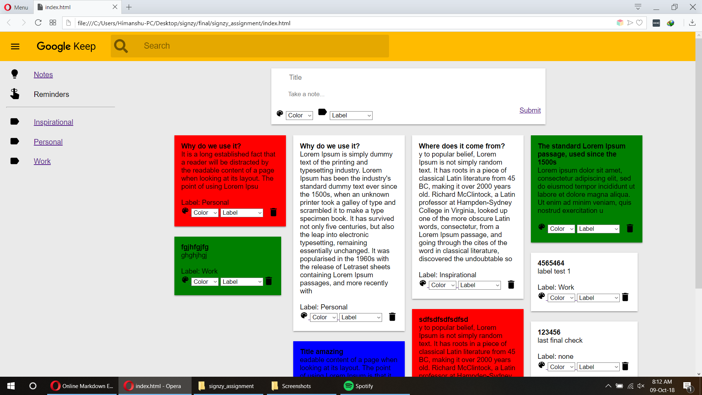

# Google Keep Replication

## Features
- Google Keep like note saving
- Notes sorting using Colours
- Notes organisez using labels
- Collaspable Sidebar
- Keep like grid style layout
- Responsive Page
- Fixed top navigation bar header
- HTML5 storage, no backend needed

Note- This web app will not work in I.R or edge if run locally, due to security protocols imposed by microsoft ie and edge browser can't use HTML5 localstorage in file:// protocal (locally hosted), however it will work as expected when deployed on a live server.

## Screenshot

### Thank You

Project created by- Himanshu Kumar
email- himanshuk27@gmail.com
https://www.linkedin.com/in/himanshuk27